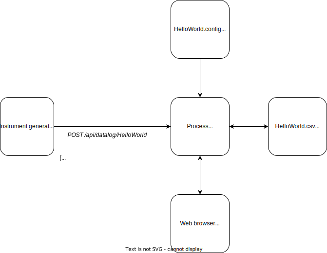

# Nuts.Datalog

## The concept

A server process that exposes a web API that accepts JSON data and logs to datalog files (CSV). The logging process is configurable and arbitrary code can run to generate additional data values for the datalog. A web interface allows the charting of datalogs and live viewing of new data.

[Example config: HelloWorld.config](source/Nuts.Datalog.Web/Configs/HelloWorld.config)  
[Example datalog: HelloWorld.csv](source/Nuts.Datalog.Web/Datalogs/HelloWorld.csv)

## An example scenario

In the lab: a digital multimeter measuring a voltage from a circuit once a second. A temperature & humidity sensor monitoring the environmental conditions. Voltage/temperature/humidity readings collected by an embedded device (e.g. Pi Pico W) or a script running on a PC/SBC, once per second, and sent to Nuts.Datalog to perform further processing and storage to CSV. This runs for weeks at a time, so the user can browse the historical & live data on the web interface whenever they desire. The user can export the CSV from the web interface at any time to get further insight in a spreadsheet, Jupyter notebook or script.

## How does this differ from...

There are a lot of feature-complete projects that have some kind of overlap with this one, examples: InfluxDB, Grafana, Jupyter, LibreOffice.

So it is probably easier to state the objectives of this one:

- Easy to deploy & maintain.
  - Why? It is frustrating to have to install a full stack or container to run an application.
  - Intention: a single executable.
  - Intention: up and running in seconds.
  - Intention: good performance.
- Easy to configure both the application and the data logging.
  - Why? It is frustrating to not be able to open a configuration file and self-discover the options available.
  - Intention: human readable & extensively commented configuration files.
  - Intention: source control (e.g. github) will show clear diff view.
- Human readable datalog storage.
  - Why? It is frustrating to watch your data go stale in a format that isn't easily accessible.
  - Intention: CSV files, highly interoperable.
  - Intention: source control (e.g. github) will show clear diff view.
- A fast web interface.
  - Why? It is frustrating to use a slow UI when you're in the middle of discovering insight about your data.
  - Intention: use fast charting.
  - Intention: serve as much static content as possible.
  
What it will not do:

- Live storage of a high rate of data (e.g. no faster than once a second)
  - Why? Storing high rate data is better done locally within a script.
  - Note: This may change in future. For non-live storage, there may eventually be a way to batch import large amounts of data for background processing & storage.
