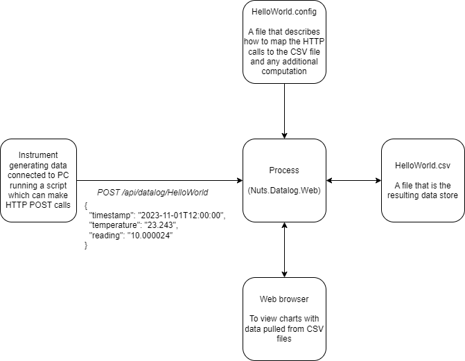

# Nuts.Datalog

## The concept

A server process that exposes a web API that accepts JSON data and logs to CSV files. The logging process is configurable and arbitrary code can run to generate additional data values for the CSV. A web interface allows the charting of CSV data and live viewing of data.

